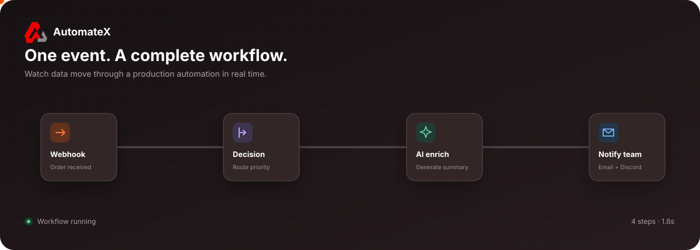
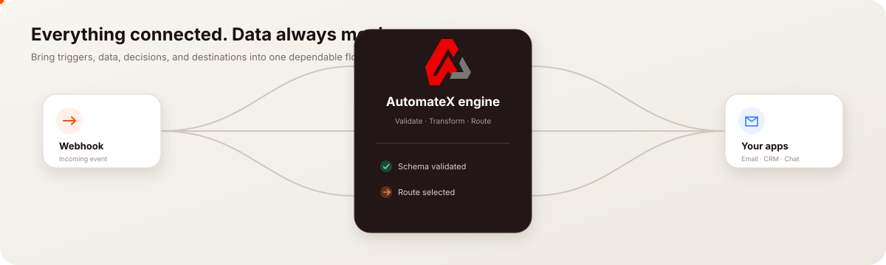
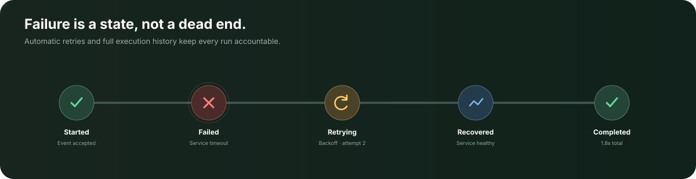

<div align="center">
  
  <h1>AutomateX</h1>
  <p><strong>Design, run, and debug reliable automations from one visual workspace.</strong></p>
  <p>
    
    
    
    
  </p>
</div>



## What is AutomateX?

AutomateX is a full-stack workflow automation platform for building production-ready integrations on a visual canvas. Connect triggers, conditions, AI models, databases, files, and third-party services; then follow every run through execution history, retries, and debugging tools.

### Highlights

- **Visual workflow builder** powered by React Flow with configurable, reusable nodes.
- **Execution engine** with branching, expressions, retries, loops, delays, and scheduled runs.
- **AI workflow tools** for generating, explaining, optimizing, and repairing workflows.
- **Integrations** for Google Sheets, Gmail, Discord, GitHub, webhooks, databases, and HTTP APIs.
- **Credential vault** with encrypted integration credentials and connection testing.
- **Production visibility** through execution timelines, performance inspection, replay, and a dead-letter queue.
- **Workflow lifecycle** with drafts, publishing, version history, comparison, and restoration.

### Connect the tools your team already uses



## How it works

```text
Trigger → Transform or decide → Call apps and services → Inspect every result
```

1. Choose a trigger such as a webhook, schedule, or Google Sheets event.
2. Add actions and logic on the drag-and-drop canvas.
3. Map data between steps with dynamic expressions.
4. Test, publish, and monitor the workflow from the same workspace.

### Built to recover when services fail



## Technology

| Layer | Stack |
| --- | --- |
| Frontend | React 18, Vite, React Router, Tailwind CSS, React Flow |
| Backend | Node.js, Express, ES modules, JWT authentication |
| Database | MongoDB with Mongoose |
| Runtime | Cron scheduling, webhooks, executor registry, retry and reliability services |
| Tooling | Axios, React Hook Form, Puppeteer, Google APIs |

## Local development

### Prerequisites

- Node.js 18 or newer
- npm
- MongoDB running locally or a MongoDB connection string

### 1. Clone the repository

```bash
git clone https://github.com/ThakurDivyanshsingh-77/AutomateX.git
cd AutomateX
```

### 2. Configure the backend

Create `backend/.env` and add the values needed for your environment:

```env
PORT=5000
MONGO_URI=mongodb://127.0.0.1:27017/workflow_platform
JWT_SECRET=replace_with_a_long_random_secret
ENCRYPTION_SECRET=replace_with_another_long_random_secret
FRONTEND_URL=http://localhost:5173
```

Optional integration keys such as Google, Gemini, OpenAI, Groq, or xAI can be added when their corresponding nodes are used. Never commit `.env` files or real credentials.

### 3. Start both applications

Open two terminals:

```bash
# Terminal 1 — API
cd backend
npm install
npm run dev
```

```bash
# Terminal 2 — web app
cd frontend
npm install
npm run dev
```

The frontend runs on `http://localhost:5173` and the API defaults to `http://localhost:5000`.

To point the frontend to another API, create `frontend/.env`:

```env
VITE_API_URL=http://localhost:5000/api/v1
```

## Project structure

```text
AutomateX/
├── frontend/          React application and visual workflow builder
├── backend/           Express API, execution engine, workers, and integrations
├── docs/              Documentation and repository media
├── uploads/           Local development uploads
├── PROJECT_CONTEXT.md Engineering context and architecture notes
└── README.md
```

## API overview

The versioned API is available under `/api/v1`.

| Area | Base route |
| --- | --- |
| Authentication | `/api/v1/auth` |
| Workflows | `/api/v1/workflows` |
| Executions | `/api/v1/executions` |
| Credentials | `/api/v1/credentials` |
| Templates | `/api/v1/templates` |
| Reliability | `/api/v1/reliability` |
| AI tools | `/api/v1/ai` |
| Webhooks | `/api/v1/webhooks` |

Health check: `GET /health`

## Contributing

1. Create a focused branch from `main`.
2. Keep changes scoped and follow the existing project structure.
3. Run the relevant build or tests before opening a pull request.
4. Describe both the user-facing change and how it was verified.

## License

AutomateX is available under the [MIT License](LICENSE).
